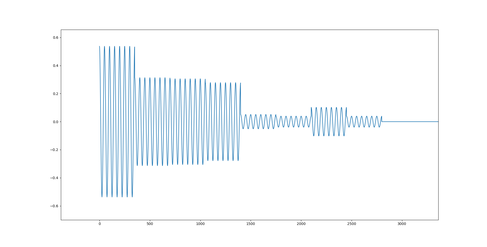

# Comment est votre modulation  1/2

Dans ce challenge, la modulation utilisée est appelée ASK (Amplitude Shift Keying). Il y a 256 amplitudes possibles utilisées.

chaque modulation differente represente un byte de l'image conteant le flag.
Nous savons que le flag est sous forme de fichier PNG grâce aux "magic bytes" (en-têtes) du fichier PNG.
