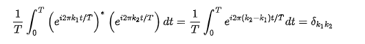

# Comment est votre modulation  2/2

Ce challenge utilise la modulation OFDM pour transmettre le flag. Cette modulation est composée d'une somme d'exponentielles complexes. Chaque exponentielle complexe est multipliée par un nombre complexe qui représente 4 bits du flag. L'enjeu du challenge est qu'à partir de la somme de ces exponentielles complexes, on puisse retrouver l'amplitude relative de chacune d'entre elles.

Pour ce faire, on peut utiliser la formule suivante :

